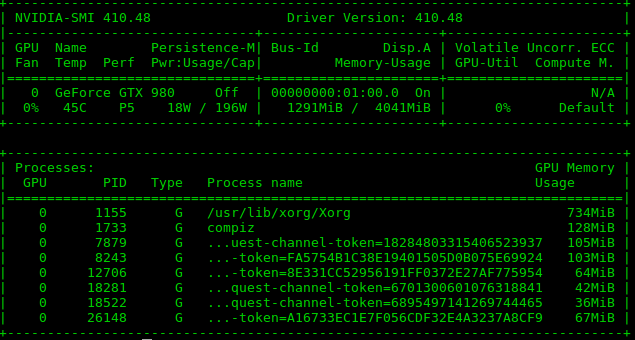

GPU Setup
#########

Following the steps shown at :ref:`fresh_ubuntu`, Tensorflow will use the CPU for all the computational problems. To make TensorFlow use your GPU, you need to do some more installation.

There is **many** ways to install TensorFlow / CUDA. This guide is only one of them.

As the writting of this documentation, `TensorFlow GPU`_ is officially supported for `CUDA`_ 9.0 with Nvidia drivers > 384.x and `cuDNN`_ >= 7.2

After these steps, you will have installed:

* CUDA 9.0 and it's dependencies
* cuDNN 7.3.0 and it's dependencies
* TensorFlow with GPU support and it's dependencies

Step 0 - Dependencies
=====================

You should have most of theses already.

.. code-block:: bash

    sudo apt-get install build-essential cmake git unzip zip python-pip python3-pip python-virtualenv swig python-wheel libcurl3-dev curl python-dev python3-dev python-numpy python3-numpy
    sudo apt-get install linux-headers-$(uname -r)

.. _step_1:

Step 1 - Cleanup
================

You need to make sure that you have nothing `Nvidia` or `CUDA` related installed on your machine.

You can follow theses steps if you want to uninstall `CUDA`, `Nvidia` and `Tensorflow` from your machine.

Do not worry, `Nvidia` drivers will be installed with `CUDA` later on.

* Remove all `Nvidia` and `CUDA` related installation

.. DANGER::
    **Be careful, the following steps are destructive and will uninstall and remove any Nvidia drivers installed**

.. code-block:: bash

    sudo apt-get purge nvidia*
    sudo apt-get purge cuda* # You may need to manually purge them, for example sudo apt-get purge cuda-cusparse-9-0
    dpkg -l | grep '^rc' | awk '{print $2}' | grep cuda | sudo xargs dpkg --purge   # verify the output first so you don't delete something else...
    dpkg -l | grep '^rc' | awk '{print $2}' | grep nvidia | sudo xargs dpkg --purge # verify the output first so you don't delete something else...
    sudo apt-get autoremove
    sudo apt-get autoclean
    sudo rm -rf /usr/local/cuda*

* Uninstall any TensorFlow installation

.. code-block:: bash

    pip uninstall tensorflow
    pip uninstall tensorflow-gpu

* reboot!

.. code-block:: bash

    sudo reboot

Step 1 - Install CUDA 
=====================

You can download CUDA from `Nvidia` website and manually install it, but it is preferable to use their repository and install it using `Ubuntu`'s package manager.

* Download and install CUDA 9.0

.. code-block:: bash

    curl -O http://developer.download.nvidia.com/compute/cuda/repos/ubuntu1604/x86_64/cuda-repo-ubuntu1604_9.0.176-1_amd64.deb
    sudo apt-key adv --fetch-keys http://developer.download.nvidia.com/compute/cuda/repos/ubuntu1604/x86_64/7fa2af80.pub
    sudo dpkg -i ./cuda-repo-ubuntu1604_9.0.176-1_amd64.deb
    sudo apt-get update
    sudo apt-get install cuda-9-0 # this may take a while (~1.7G)

* reboot!

.. code-block:: bash

    sudo reboot

* Verify installation

.. code-block:: bash

    nvidia-smi # should return a list of GPUs with some metrics. Make sure the driver's version shown on the top is > 384.x

.. code-block:: bash

    nvcc -V # should return the CUDA compiler version installed. Make sure the version is 9.0

    # example

    nvcc: NVIDIA (R) Cuda compiler driver
    Copyright (c) 2005-2017 NVIDIA Corporation
    Built on Fri_Sep__1_21:08:03_CDT_2017
    Cuda compilation tools, release 9.0, V9.0.176

If you do not pass any verification steps, go back to :ref:`step_1`.

Step 2 - Install cuDNN 
======================

Download `cuDNN` 7.3.0 for `CUDA` 9.0 from `Nvidia`'s `cuDNN archive`_. 

You may need to create a account if you do not have one yet.

* Download and install

.. code-block:: bash

    sudo tar -xzvf cudnn-9.0-linux-x64-v7.3.0.29.tgz
    sudo cp cuda/include/cudnn.h /usr/local/cuda/include
    sudo cp cuda/lib64/libcudnn* /usr/local/cuda/lib64
    sudo chmod a+r /usr/local/cuda/include/cudnn.h /usr/local/cuda/lib64/libcudnn*

* Update your bashrc. 

In the case you have different `CUDA` version installed, change the folder to the `CUDA` version you want.

.. code-block:: bash

    echo 'export LD_LIBRARY_PATH="$LD_LIBRARY_PATH:/usr/local/cuda/lib64:/usr/local/cuda/extras/CUPTI/lib64"' >> ~/.bashrc
    echo 'export CUDA_HOME=/usr/local/cuda' >> ~/.bashrc
    echo 'export PATH="$PATH:/usr/local/cuda/bin"' >> ~/.bashrc
    . ~/.bashrc

Step 3 - Install TensorFlow GPU 
===============================

* Uninstall `TensorFlow`

.. code-block:: bash

    pip uninstall tensorflow

* Install `TensorFlow` with GPU support under `python3`

.. code-block:: bash

    python3 -m pip install --user tensorflow-gpu    

* Verify installation

.. code-block:: bash

    python3
        import tensorflow as tf   
        hello = tf.constant('Hello, TensorFlow!')
        sess = tf.Session() # You should see some information about your GPU in the output
        print(sess.run(hello))

    # in another shell
    nvidia-smi # you should see in the processe list python3

If you do not pass any verification steps, go back to :ref:`step_1`.

Step 5 - Profit
===============

Have fun!

.. _TensorFlow GPU: https://www.tensorflow.org/install/gpu
.. _CUDA: https://developer.nvidia.com/cuda-toolkit
.. _cuDNN: https://developer.nvidia.com/cudnn
.. _cuDNN archive: https://developer.nvidia.com/rdp/cudnn-archive