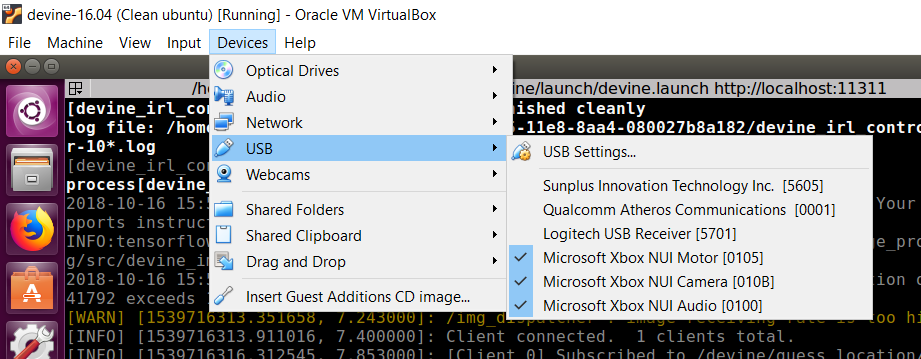

Virtual Box
###########

The DEVINE project can be installed in a virtual machine.

To do so, make sure you have a VM with Ubuntu 16.04 installed, and follow the steps of installing :ref:`fresh_ubuntu`.

Note about running the project in Virtual Box
=============================================

To allow the Xbox Kinect connected physically to the host to communicate with the VM, you must link your USB devices from the host to the client:

There should be three devices to select for the Kinect:

* Microsoft Xbox NUI Motor
* Microsoft Xbox NUI Camera
* Microsoft Xbox NUI Audio

If you get an error while linking the devices, it may be possible that the device is busy by another process. The simplest way to solve that is to restart the client and restart the host.

You may also need to install `Oracle VM VirtualBox Extension Pack <https://www.virtualbox.org/wiki/Downloads>`_ in order to allow the use of **USB 2.0** in the settings of your VM.
